# 《车万女仆：心契同眠》介绍

心契同眠是一款将《车万女仆》推向 Galgame 式长期陪伴的恋爱、婚姻与家庭扩展模组。它围绕“与女仆共同走过完整人生”这一核心，完整实现了以下内容：

- 日常互动：对话、送礼、摸头、拥抱、亲吻，好感度逐步提升。
- 恋爱阶段：表白、交往、交换戒指、举办婚礼。
- 婚后生活：同床共眠、怀孕系统、育儿系统。
- 后代养成：小女仆的成长阶段、专属任务、互动内容。

这个模组让你和女仆从主仆关系开始，一步步经历心动、表白、结婚、同床共眠，到怀孕生子，最终让她从冒险伙伴变成与你共度一生的家人。

## 实机截图

主界面与成年女仆互动：

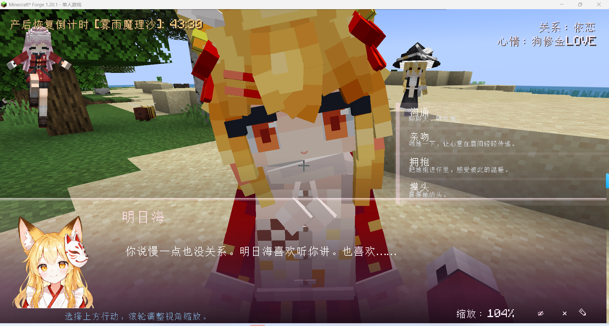

摸头、拥抱和举高高：

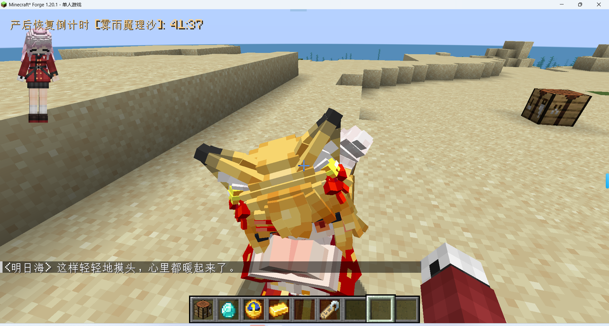

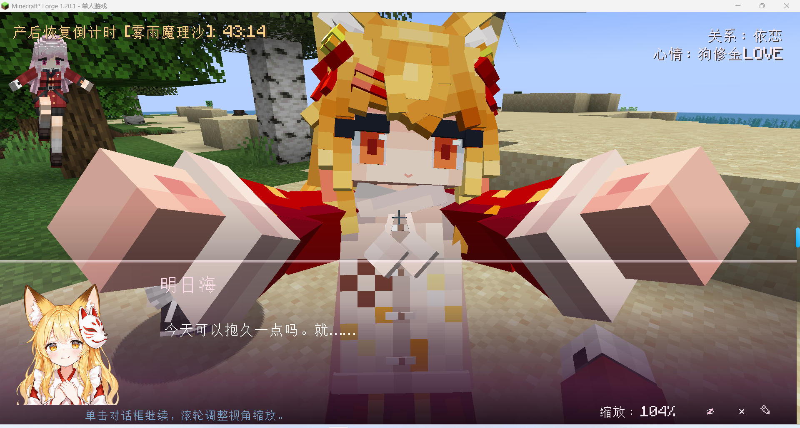

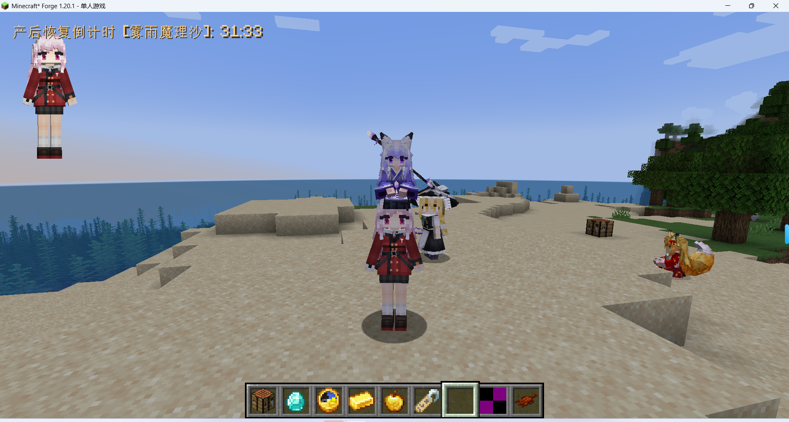

孩子出生后，可以进入小女仆专属互动界面：

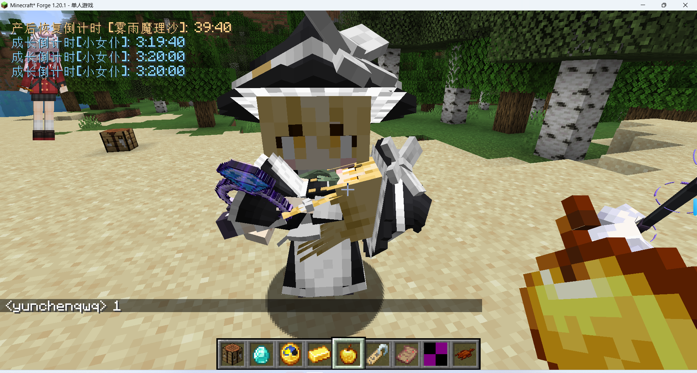

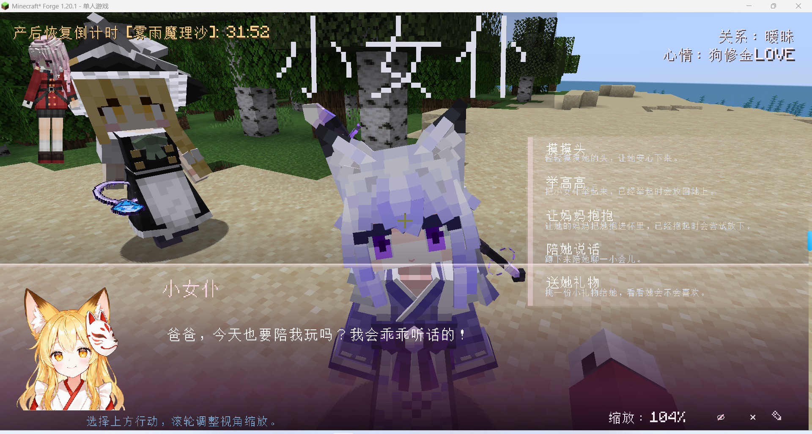

## 先说怎么玩

进游戏后先打开“选项 -> 控制 -> 心契同眠”，检查三个按键：

- 交互按键：默认 Alt + J，用来打开成年女仆或小女仆的互动界面。
- 摸头/举高高：默认 Alt + K。坐下的女仆会摸头，站着的小女仆会举高高。
- 节奏判定键：默认 J，同眠剧情中的节奏玩法使用。也可以在模组设置里选择跳过。

按键以 Minecraft 原版控制设置为准。模组设置页里可以调整举高高高度、拥抱距离、称呼、后宫模式、节奏跳过和调试显示。举高高高度偏移默认 0.10，可调范围 -0.20 到 1.50；拥抱锁定距离默认 0.80，可调范围 0.10 到 2.00。

## 好感阶段

本模组沿用车万女仆的好感体系，并在恋爱流程里细分了几个门槛：

- 0-31：初始阶段。先聊天、送礼、照顾她。
- 32 起：摸头解锁。
- 64 起：拥抱解锁。
- 128 起：表白、亲吻、交往相关内容开始出现。
- 192 起：结婚门槛。
- 384：原版三级好感上限。

未达到门槛时，对应亲密选项不会显示。这不是 bug，而是关系还没到。

## 成年女仆互动

成年女仆互动界面里可以进行：

- 沟通：聊天、天气、生活、心事、休息、未来等话题。
- 摸头：轻量亲密互动，也适合安抚她。
- 拥抱：64 好感后出现。
- 亲吻：128 好感后出现。
- 表白：达到交往阶段后出现，接受后获得“心心相印”进度。
- 结婚：192 好感后出现，需要两枚未绑定求婚戒指。
- 赠送礼物：进入礼物界面，从背包里挑物品送她。
- 放下小女仆/给孩子取名：女仆妈妈抱着孩子时出现。

部分选项会根据她的心情、是否抱着孩子、是否已经结婚、后宫模式等条件隐藏。

## 亲吻角度校准

不同女仆模型的身高、头部骨骼和摄像机位置不完全一致。如果你在拥抱或亲吻时觉得画面对不到脸，可以用互动界面里的镜头校准按钮微调。

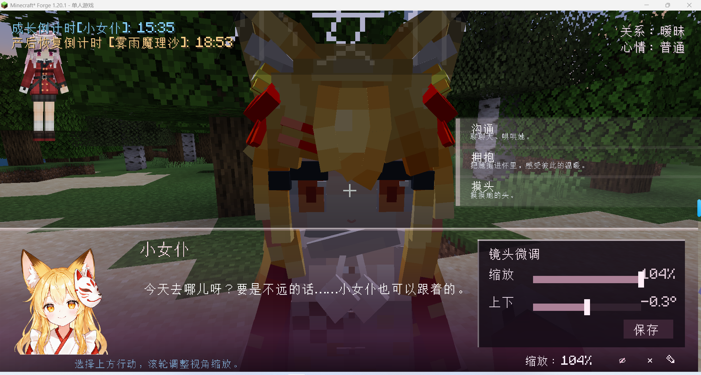

使用方法：

1. 对成年女仆打开互动界面，进入拥抱/亲吻相关界面。建议切到第一人称，这样最容易判断亲吻镜头是否对准。
2. 点击界面右下角退出按钮附近的铅笔校准按钮，打开镜头校准小面板。
3. “缩放”控制镜头远近。数值越高，画面看起来越近；如果脸贴得太近，就往回拉一点。
4. “上下”控制镜头俯仰。女仆脸偏高就往上调，女仆脸偏低就往下调。
5. 调到合适后点击保存。设置会写入本地 `config/maidmarriage/hug-camera.json`，只影响你自己的客户端，不会影响服务器或其他玩家。

一般来说，同一套模型只需要校准一次。换了身高差异很大的模型、屏幕比例或视角习惯后，可以再重新调。

## 心情系统

女仆心情分为五档：

- 沮丧
- 一般
- 普通
- 开心
- 狗修金LOVE

心情会影响好感收益：

- 沮丧/一般：正向互动不加好感。
- 普通：正常收益。
- 开心：约 1.5 倍收益。
- LOVE：约 2 倍收益。

聊天、玩笑、亲密行为和送礼都会受心情影响。心情差时继续开玩笑、冒犯她、或者过度互动，会直接扣好感。恋人或妻子如果连续几天没有有效互动，也会进入想被陪伴的状态。

## 礼物系统

礼物需要从互动界面的礼物 UI 赠送。每天最多送两次。

礼物大致分为：

- 花束：普通花、五彩花束。主要提升关系。五彩花束可以重复送。
- 甜食：曲奇、蛋糕、南瓜派、蜂蜜瓶、甜浆果、苹果、金苹果等。更适合安抚低落心情。
- 正餐：面包、牛奶、熟肉、熟鱼、炖菜、酱板鸭等。偏稳定恢复心情。
- 贵重物：钻石、绿宝石、金锭、铁锭、紫水晶、石英、青金石、下界合金碎片等。关系越近越容易获得好反馈。
- 奇怪礼物：骨头、蜘蛛眼等，可能让她困扰。
- 冒犯礼物：腐肉、毒马铃薯、发酵蛛眼、河豚等，会扣心情和好感。

求婚戒指、YES 枕头、金蒲公英发卡、婚姻同意申请书等特殊物品不能当普通礼物送。

## 物品与用途

求婚戒指  
钻石 + 铁粒合成。它可以作为女仆戒指饰品佩戴。结婚时玩家主手和副手各需要一枚未绑定戒指。

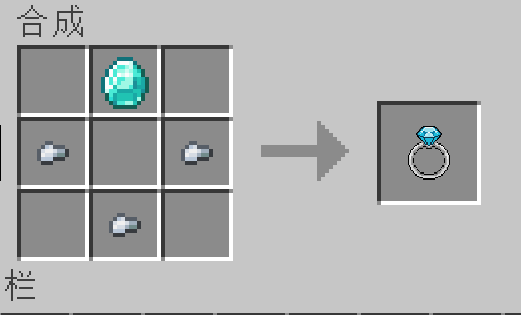

誓约之环  
结婚流程中由求婚戒指刻上双方名字生成，本质是刻过誓约的女仆戒指饰品，不是普通合成物。刻好后会记录双方名字，不能再拿去向别人求婚。

YES 枕头  
白羊毛和红羊毛合成，也会在结婚成功后交给女仆。婚后同眠流程会用到。

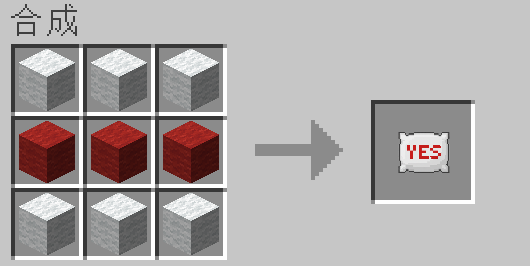

五彩花束  
滨菊、虞美人、矢车菊、粉色郁金香、蒲公英无序合成。适合送礼。

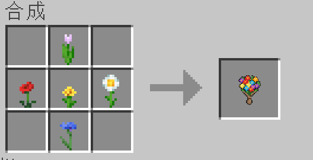

金蒲公英发卡  
时钟 + 金锭 + 蒲公英无序合成。它是女仆饰品，放进小女仆饰品栏后可以暂停成长；取下后，小女仆会继续按正常天数成长。

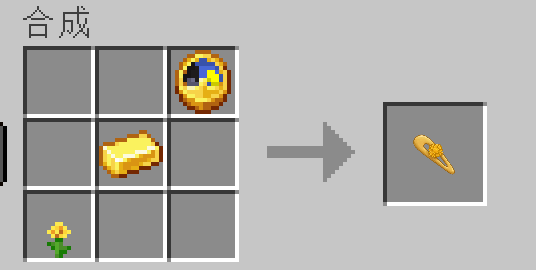

酱板鸭  
熟鸡肉 + 一圈可可豆合成。喂小女仆可缩短成长时间；喂产后女仆可缩短产后恢复剩余时间。

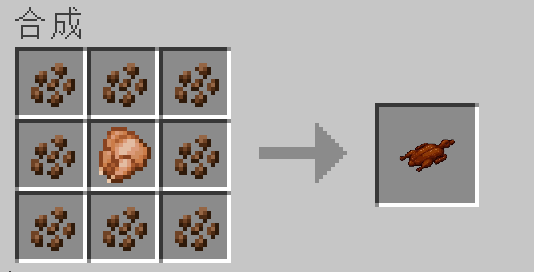

婚姻同意申请书  
书 + 求婚戒指无序合成。用于成年子代女仆的监护权移交，不是直接结婚道具。

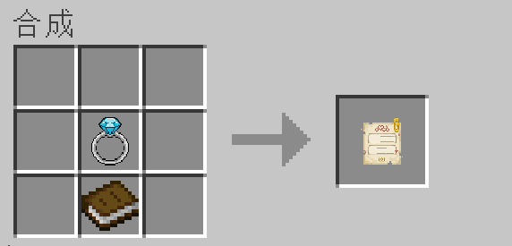

族谱查看器  
骨粉 + 书无序合成。手持后右键女仆，会在聊天框显示她的家庭关系。

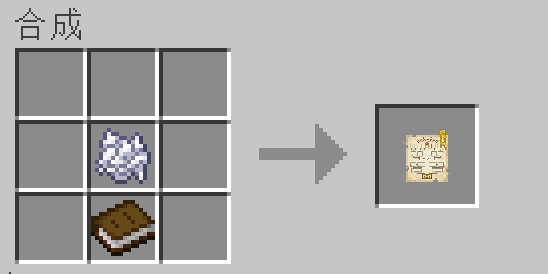

## 族谱查看器和婚姻同意申请书

族谱查看器的用法很简单：手持它右键女仆，聊天框会显示这位女仆的本人、母系、父系、祖辈、配偶，以及直系子代。直系子代最多显示 8 位，超过的会提示还有多少位未显示。某些亲属如果不在当前世界或名字无法解析，会显示未知或 UUID 简写。

婚姻同意申请书用于将自己已经成年的子代女仆许配给其他玩家。说得直白一点，就是把自己的女儿交给另一位玩家重新培养关系；它不是普通结婚道具，也不能跳过对方之后的恋爱流程。它的流程是两步：

1. 当前主人手持申请书，右键一位已经成年的子代女仆。申请书会绑定这位女儿，物品提示里会显示“已绑定女仆”。
2. 继续手持同一份申请书，右键目标玩家。目标玩家不能是你自己，也不能是这位女仆两代内直系血亲。

许配成功后，这位女仆会归目标玩家管理，婚姻数据清空，好感度重置为 0。目标玩家之后需要从头培养关系，才能继续表白或结婚。

如果申请书已经绑定了一位女仆，再去右键另一位成年子代女仆，会改绑到新的女仆，并清掉旧目标玩家绑定。

## 结婚与同眠

结婚条件：

- 是你自己的成年女仆。
- 好感达到 192。
- 玩家主手和副手各有一枚未绑定求婚戒指。
- 当前没有被后宫模式或婚姻状态拦截。

结婚成功后，女仆会收下 YES 枕头。之后她睡在女仆床上，玩家在相邻的原版床旁满足条件时，可以触发同眠剧情。同眠可能进入节奏玩法，也可以按设置跳过。

怀孕概率分两套：

- 普通同眠：第一次 20%，之后每次失败 +5%，最高 50%。如果连续失败 8 次，下一次必定怀孕。
- 节奏玩法：按成绩从 0% 到 60% 换算怀孕率，不吃普通同眠的失败保底。跳过或超时按 0 分处理。

普通同眠按这条曲线计算，平均大约 3.4 次同眠会怀孕；约 58% 的情况会在 3 次内成功，约 91% 的情况会在 6 次内成功，最晚第 9 次必定成功。怀孕成功后有 2% 概率是双胞胎；普通同眠触发连续失败保底时，会直接按双胞胎处理。

分娩天数、孩子成长天数和产后恢复期由服务端 common 配置控制。

## 小女仆和家庭

孩子出生后会成为小女仆。出生第一天还不能放到地上，需要妈妈抱着。默认名字是“小女仆”，处于婴儿阶段且未改名时，可以给她取名，只能取一次。

小女仆互动包括：

- 摸摸头
- 举高高
- 让妈妈抱抱
- 陪她说话
- 送她礼物

举高高状态下，小女仆免疫方块窒息伤害。玩家鞘翅滑翔时也可以继续带着她飞，她会偶尔说说在天上的感受，并获得少量心情。

## 小女仆任务

小女仆成长到儿童阶段后，可以安排任务。任务只在女仆 WORK 日程中推进；睡觉、坐下、休息时间会暂停。

附魔学  
条件：主手或背包有书本。  
结果：附魔相关奖励。心情太低时可能只给普通书或低级成果。

药剂学  
条件：主手或背包有玻璃瓶或药水。  
结果：药剂相关奖励。心情太低时可能退化成水瓶、粗制药水等。

战术学  
条件：主手或背包有武器，剑、斧、弓、弩、三叉戟都可以。  
结果：战斗相关奖励。心情太低时只给低品质战斗物品。

探险  
条件：主手或背包有木棍。  
结果：随机带回物资。好感越高，空手而归和受伤概率越低，奖励数量和稀有发现概率越高。心情低到 0 时会停止探险。

## 常见问题

为什么选项不出现？  
通常是好感阶段不够、对象不是自己的女仆、成年/小女仆入口用错、女仆坐下或睡觉，或者后宫模式限制。

为什么结婚失败？  
检查两枚戒指是不是未绑定求婚戒指。刻过誓约的戒指不能重复使用。

为什么任务不推进？  
确认小女仆有背包，处于 WORK 日程，没有坐下或睡觉，材料在主手或背包里。

为什么多人服务器和单人不同？  
分娩天数、成长天数、产后恢复由服务端 common 配置控制。怀孕概率按上面写的普通同眠/节奏玩法两套固定规则结算。后宫模式是玩家本地设置同步到服务端。

## 一句话总结

这个模组将《车万女仆》从单纯的冒险辅助，扩展成一段可以慢慢经营的 GalGame 式情感旅程：从清晨的问候到深夜的闲聊，从随手摸头到认真拥抱，从送出一份心仪的礼物，到终于鼓起勇气说出那句“喜欢”，你们会在无数个平淡日常里渐渐靠近。感情足够深时，你可以向她郑重表白，为她戴上亲手打造的戒指，许下相伴一生的誓言；婚后的夜晚，她会在你身边安然入睡，也会在某一天红着脸告诉你那个惊喜的消息。随后，你们一起等待、一起期待，最终迎来那个既像她又像你的小生命。从那一刻起，她不再只是女仆、恋人或妻子，而是与你共同生活的家人；你也不再只是孤单的冒险者，而是丈夫、父亲，以及这个完整故事的主角。
